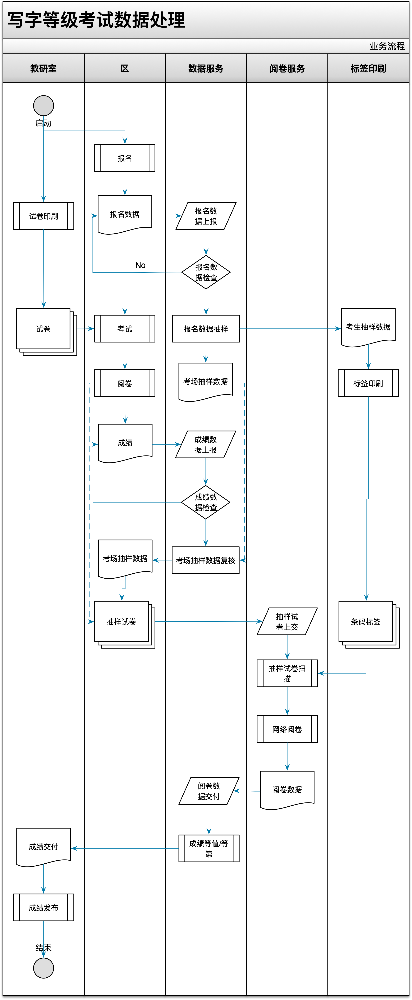

# 上海市写字等级考试数据处理

## 业务流程




```flow

st=>start: 开始
ed=>end: 结束
register=>subroutine: 区报名
reg_data_in=>operation: 报名数据上报
reg_data_check=>condition: 报名数据检查
reg_data_sample=>operation: 报名数据抽样
sample_data_label=>subroutine: 条码印刷
test=>subroutine: 考试
scoring=>subroutine: 区阅卷
score_data_in=>operation: 成绩数据上报
score_data_check=>condition: 成绩数据检查
sample_paper_in=>subroutine: 抽样试卷上交
sample_scaning=>subroutine: 试卷扫描
sample_scoring=>subroutine: 网络阅卷
sample_score_in=>operation: 阅卷数据交付
score_normalize=>operation: 成绩等值/等第
score_realse=>operation: 成绩发布


st->register
register->reg_data_in
reg_data_in->reg_data_check
reg_data_check(yes)->reg_data_sample
reg_data_sample->sample_data_label
reg_data_check(no)->reg_data_in
reg_data_check(yes)->test
test->scoring

scoring->score_data_in
score_data_in->score_data_check
score_data_check(yes)->sample_paper_in
score_data_check(no)->score_data_in
sample_data_label->sample_scaning
sample_paper_in->sample_scaning
sample_scaning->sample_scoring

sample_scoring->sample_score_in
sample_score_in->score_normalize
score_normalize->score_realse
score_realse->ed

```
